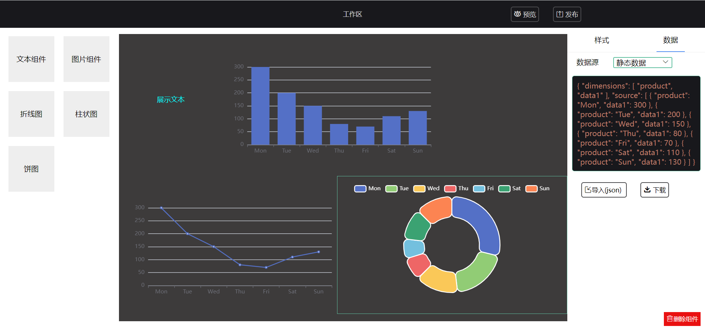

# LingBIView 

（持续更新中......）

#### 介绍

物联网低代码可视化平台

LingBIView 是一个高效的拖拽式低代码数据可视化开发平台，将图表或页面元素封装为基础组件，无需编写代码即可制作物联网数据大屏。

#### 项目截图：




#### 主要技术栈

| 名称    | 版本  | 名称        | 版本   |
| ------- | ----- | ----------- | ------ |
| Vue     | 3.2.x | TypeScript4 | 4.7.x  |
| Vite    | 2.9.x | Axios       | 0.27.x |
| ECharts | 5.3.x | Pinia       | 2.0.x  |

详见package.json


#### 安装

本项目采用` npm` 进行包管理

```
npm install
```

#### 启动

```
npm run dev
```


